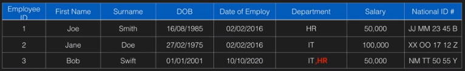
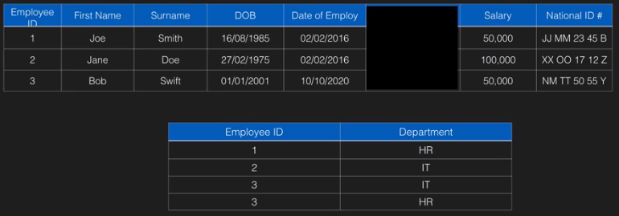
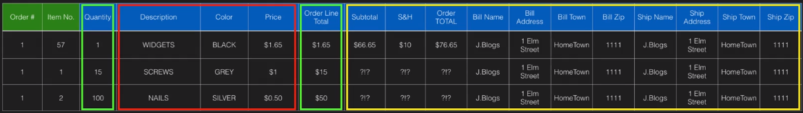
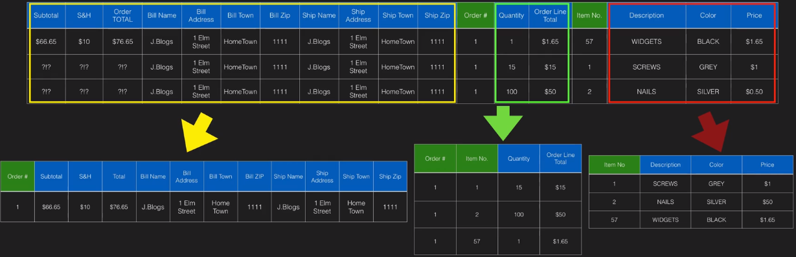
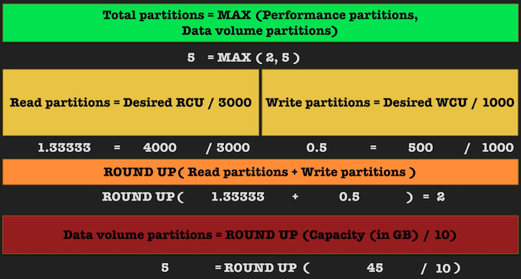
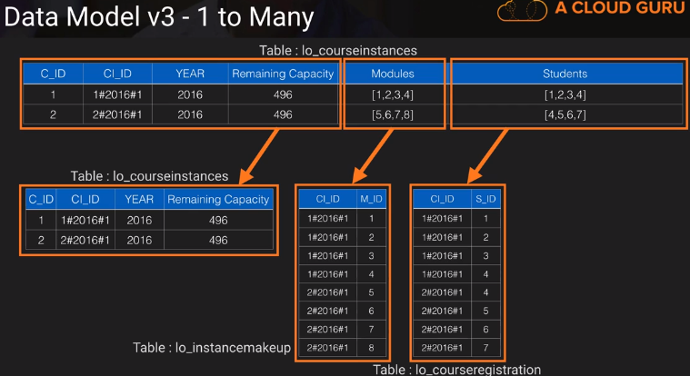
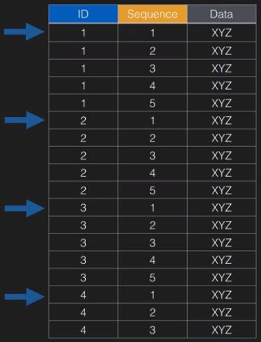
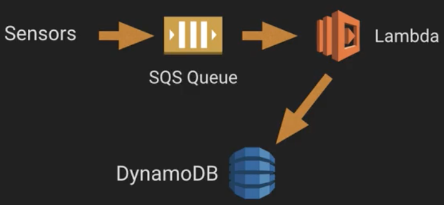
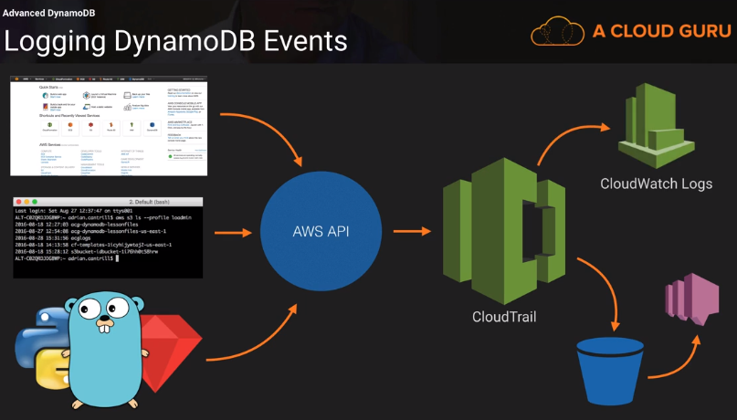

    
      Repo is based on 2016 course titled <a href="https://acloud.guru/learn/aws-dynamodb">AWS DynamoDB - From Beginner to Pro</a>

# Chapter 2 - Database Fundamentals

## Database Fundamentals - Part 1
- __What's a "Candidate Key"? (in SQL)__ - (4:00) any columns which can uniquely identify a row. Cannot have null or duplicate values.
- __What's a "Primary Key"? (in SQL)__ - (5:00) one candidate key, selected to provide unique identification of every row in the table.
- __What's a "Foreign Key"? (in SQL)__ - (5:30) maps to a primary key in another table. Uniquely identifies a row (Primary key value) in another table. Foreign key doesn't need to be unique in the table it's in.
- __What are "Primary Keys" called in NoSQL databases__ - (6:25) "Hash keys" or "Partition keys" in NoSQL databases.
- __What types of keys do NoSQL databases lack?__ - (6:35) Foreign keys, since NoSQL databases are not relational.
- __How do "Many-to-Many" relationship? (in SQL)__ - (15:30) Example: Lets assume we have `Employee` and `Department`. A `Department` can have many `Employee`s, and an `Employee` can be in many `Department`s. This is a man-to-many relationship. If you have an `Employee` table, and the `Employee` needs to be in 2 `Departments` (IT, HR), you can't do that in SQL:

We can create a many-to-many relationship using 2 one-to-many tables. We rip out the `Department` column and make a new table for it. Now the combination of _Employee ID_ and _Department_ makes each row unique.

## Database Fundamentals - Part 2

- __(SQL) You have 1 database server with 2 giant tables in it. How scale it?__ (2:40) 3 solutions
    1. Horizontal scaling - throw extra CPU and memory at the problem. Con: Costly, and we eventually hit a hardware ceiling.
    1. Database segmentation - Use 2 databases (instead of 1), with 1 table in each database. Pro: Simple. Con: Cross-table queries are extremely slow.
    1. Row-level partitioning - Use 2 databases. For each table, put even rows in 1 table, odd rows in another table. (For our Staff table, we will reverse the logic) Logic can be based on either row numbers, ranges of values in those rows, or a hash on certain fields.
        - Pro: scales near-linearly with the number of database servers (assuming rows are accessed fairly evenly).
        - Con: Only works well if rows are accessed fairly evenly. Also, there are performance penalties for cross-table queries. This can be mitigated (but beyond scope of course).

## Data Normalisation

- __(SQL) What is 1NF, 2NF, 3NF normal form?__ (entire video)

#### 1NF

- Unique primary keys.
- Cannot have duplicate primary key values.
- No attribute can contain more than 1 piece of information (that is, can't have a many-to-many relationship).

#### 2NF

- Prerequisite of having data in 1NF.
- If we have a Primary Key + Composite key, each attribute in the table should depend on both of these keys. Otherwise we split up the table into more tables

The above table can be split up into 3 tables:

#### 3NF

- Values of attributes should not depend on other non-key attributes

#### Normalization Theory

- __Is database normalization required for NoSQL databases?__ - (0:50) Not required for NoSQL databases.
- __Why do we normalize data?__ - (16:13)
    - Pros
        - Cost: less storage needed due to no data duplication
        - Speed: less data results in faster processing of that data
        - Data Integrity: no data duplication, so less consistency errors
        - Faster updates: update data once and have it cascade to all related records
    - Cons
        - More complex queries, requiring more processing

## NoSQL Database fundamentals - Part3 - Document

- __How do Document DBs store data?__ - (1:10) Documents are XML, JSON, etc. Data can be nested in these documents.
- __How do Document DBs scale?__ - (2:10) Scaling is based on documents. Add more documents, and they will be spread across nodes or partitions.
- __Is processing across document boundaries efficient?__ - (2:26) No.
- __What is an example of a Document Database?__ - (3:25) MongoDB.

## NoSQL Database fundamentals - Part4 - Column Store

- __What is a column-based database?__ - (0:10) A database where tables are stored and grouped by column instead of row.
- __What is benefit of row-based tables?__ - (2:45) Fast for single-record processing.
- __What are benefits of column-based tables?__ - (3:45)
    - More efficient when updating an entire column - all the data for 1 column is stored contiguously next to each other.
    - Better compression - values in columns are of similar type and don't have many possible values
    - Better parallel processing - data in different columns can be processed by different partitions/machines.
- __When are column-based tables used?__ - (4:45) used when huge quantities of data need to be stored for later aggregate-based analysis.

## NoSQL Database fundamentals - Part5 - Graph

- __What type of relationships are easy with Graph DBs?__ - (1:45) many-to-many relationships.
- __What are 4 building blocks of Graph DBs?__ (2:35)
  - Nodes
  - Properties - key/value pairs representing attributes for nodes.
  - Relationships - relationships between nodes, like "employee of". Relationships can also have properties.
  - Labels - groups nodes into sets
- __What is 1 example Graph DBs are useful for?__ - Web apps with social components.

## JSON 101

- __What are types a JSON "value" can have?__ - (1:40) Number, string in quotes, boolean as true/false, array, object, or null.

# Chapter 3 - DynamoDB Basics

## Dynamo DB Introduction

- __What are 2 qualities of a Partition key?__ - (9:35) has to be present. Has to be unique. Sometimes called a "Hash Key".
- __What's a Sort key?__ - (10:10) Similar in function to a composite key in relational databases. Allows multiple items to exist for each Partition key value. Using a sort key, an item would be uniquely identified using the Partition Key and the Sort key.

## Dynamo DB Consistency Model

- __What type of consistency in DynamoDB?__ - Eventual consistency. DynamoDB values performance over consistency.
- __What's a strongly consistent read?__ - (6:40) Requesting accurate data without the "eventual consistency" problem.

## DEMO - Console Basics

- __When can you create a "local secondary index"?__ - (7:30) Can only create it when the table is created. If trying to create it after the table is created, you would have to recreate the table.
- __What does a "local secondary index" do?__ - (8:10) Lets you create an alternative sort key (giving you an alternative view of the table).
- __What do Global Secondary Indexes (GSI) do?__ - (12:45) allow an alternative partition and an alternative sort key.

## DEMO - Working with Tables

- __What does the command-line `wait` command do?__ - (16:35) - can be used to wait until `table-exists`. In the command-line, tables are created asynchronously, so we could use the `wait` command to ensure table is created before we update it.

## Controlling Table Performance

- __What does Provisioned Capacity apply to?__ - (1:00) Each table. Independent control of Read & Write.
- __What is size of Read Capacity Unit (RCU)__ - (4:50) up to 4KB of data per second
- __What is size of Write Capacity Unit (WCU)__ - (4:50) up to 1KB of data per second
- __Why does length of attribute names matter?__ (14:55) The names are literally stored for each item. Picking short attribute names increases performance.

## Data Model Design - Version 1 - Part 2

- __How do DynamoDB table namespaces work?__ (8:45) There are no databases in DynamoDB. All tables in your account compete in naming namespace, so prefix table names with your project name.

## DEMO - Working With Items - Part 1

- __What are required key(s) for `GET-ITEM` command?__ - (6:30) Both Partition Key and Sort Key (if applicable). It gets ONE item.
- __Can you have a key of "temperature" with String as a value for 1 item, and Number as a value for another item?__ (9:10) Yes.

## DEMO - Retrieving Items - Part 2

- __For `query`, do you need a Partition key or Sort key?__ - (0:15) You need a Partition Key. Sort Key is optional.

## DEMO - Retrieving Items - Part 3

- __What's the least ideal data-retrieval operation in DynamoDB?__ - (0:20) "scan". (2:00) you will feel it in both your wallet, and application response time.
- __What's a good use case for `scan`?__ - (3:00) We can perform an operation across partition key value boundaries. (With `query`, you always have to provide a Partition Key).

## An introduction to partitions

- __What are DynamoDB partitions?__ - (0:05) the underlying storage and performance delivery structure of DynamoDB. (2:05) a single unit that includes Compute, Storage, and any attached components required to receive data from, or deliver data to the user via the DynamoDB endpoint.
- __How can you add partitions?__ (3:40) You can't directly control number of partitions, but you can indirectly create more partitions (by storing over 10GB data, or >3000 RCU or >1000 WCU)
- __How can partitions affect your RCUs?__ (example at 8:40). If you ask for 4000 RCU (which is greater than the 3000 RCU max) then DynamoDB uses 2 partitions of 2000 RCU each. When adding partitions, if 1 of the partitions has much more data than the other partition, performance will suffer.

## Batch Operations

- __What is benefit of `BatchGetItem`?__ - (3:20) Items are retrieved in parallel (but unordered)

## DEMO - Case Study Setup: Learning Online - Part 3

- __What's a "burst pool" for Read Capacity Units (RCUs)?__ - (12:25) A table has 300 seconds of [burst pool](https://docs.aws.amazon.com/amazondynamodb/latest/developerguide/bp-partition-key-design.html#bp-partition-key-throughput-bursting). So if we have 1000 RCUs, that gives us 300,000 RCU for 5 minutes.

## Monitoring and Alerting

- __What are some useful metrics to track for DynamoDB?__ - (9:00 - 14:10) ConsumedReadCapacityUnits, ConsumedWriteCapacityUnits, ProvisionedReadCapacityUnits, ProvisionedWriteCapacityUnits, ThrottledRequests, ReadThrottleEvents, WriteThrottleEvents. [More info](https://docs.aws.amazon.com/en_pv/amazondynamodb/latest/developerguide/MonitoringDynamoDB.html)

## Lessons Learned, Refining the Learning Online Data Model v2

- __If we want to split up an item by its attributes, what can we look at in a table to see how the data in an item differs?__ - (9:00)
  1. size
  1. access patterns (ratio of reads/writes)
  1. load (# of RCUs/WCUs needed)
  1. when is it accessed and how frequent are the modifications
- __(Important) What's a good solution for having large binary data (such as an image) in DynamoDB?__ - (9:30) put it in s3 instead! He reduced the table size by 99%.

## Scaling Performance

- __How make uploads faster?__ - (entire video) do uploads in parallel (in the code) instead of sequentially. However, if we are incrementing a counter for unique ID, this will cause problems.

## Conditional and Update Expressions

- __What is an "Update Expression"?__ - (6:50) A way of having DynamoDB do server-side manipulation For example, if 2 clients want to decrease a value by 1, they might both change the value 9 to 8, and write 8 back. But if they ask the server to do it, the server will be aware of both clients and will do it properly.
- __How make read then writes faster?__ (13:00) Don't read the item! Just write the item based on a "conditional".
- __When writing, how can you read without consuming RCU?__ - (16:10 - 20:00) Use `Update-item` with `ReturnValues` to return the new updated value _without_ consuming RCU.

# Advanced DynamoDB

## Partitions Deep-Dive - Part 1

- __How are total partitions calculated?__ - See image below

- __What could go wrong when you decrease WCU?__ (14:40) DynamoDB cannot decrease the number of partitions. So if increasing our WCU gave us 10000 WCU across 10 partitions, then decreasing it to 500 WCU will still be spread to 10 partitions (at 50 WCU each)

## Partitions Deep-Dive - Part 2

- __You have 1 table with 4 Terabytes of data in it. Performance is being affected due to a lot of partitions. How solve?__ - (9:15) Store the data in multiple tables. Can possibly create a table for each year.

## Advanced Key Design

- __What is hot and cold data? How should you organize hot/cold data?__ - (4:25) hot data is accessed often. cold is not. Don't mix them together in the same table. Make a table with hot data, and give it high RCU/WCU, and for the cold table, give it low RCU/WCU.
- __You have 10 presidential candidates, 2 of them are getting all the action/votes. You have 10 partitions with partition keys as 1 to 10. What are 4 ways to make this more efficient?__
  1. (5:30 - 12:00) Use key sharding (also known as key prepending/suffixing). If we had 10 partitions, and a partition key that was very popular, then one of our partitions would have too much data. Let's say our Partition Key is `1`: we can use a random number from 1 to 50, and append `_1` or up to `_50` to get `1_1`, `1_2`,...`1_50` as keys. These new keys will now properly be distributed across the 10 partitions.
      - Con: reading data for a partition key becomes much more complex, since now we have to do 50 queries (1 for each Partition Key) instead of 1 query.
  1. (12:10) Each candidate gets their own table. New partition key as date/time can provide randomness across partition key values, but this may cause issues due to "uniformity across the key space" (I think he means the keys may be very similar to each other, which code affect how they're hashed)
  1. (12:30) write buffering (spreading writes over time to avoid hitting the partition limits). This only works if there's periods of inactivity that we can use for these writes.
  1. (13:20) Read caching - cache common data that's read often.

## Advanced Query & Scan - Part 1

- __What's the maximum return size of `scan`?__ (2:50) 1 Megabyte. In our case our items are big, so each call will return 3 items of data. If we want to continue, we need to make more `scan` calls. To get more results, we pass the last evaluated key to a `scan` operation, until we eventually receive null back.
- __What's the max return size of `query`?__ (4:20) 1 Megabyte.

## Advanced Query & Scan - Part 2

- __You have 4 partitions, and 1 scan operation, how speed it up?__ (4:00) Use parallel scans

## DEMO - Non Key searches and large sets

- __How does DynamoDB solve the many-to-many problem?__ - (15:30) An attribute can be a list or set. So a "Course" can have a set of "Student" in it.
- __What are 2 downsides of sets/lists in above example?__
  1. Getting "all courses a student is in" requires a scan operation (code shown in middle of video)
  1. In above example, it doesn't scale well. When the set gets too big (as in millions of students in 1 course, reading just 1 item can be a huge data set)

## Local Secondary Indexes (LSI) - Part 1

- __What is max # of LSIs in a table?__ (1:55) 5.
- __What is "item projection" in reference to LSIs?__ (6:00) Only Partition Key, Sort Key, and LSI are stored. To store attributes as well, you have to use projected attributes. In below picture, the green "Sort" is the LSI.

## Local Secondary Indexes (LSI) - Part 2

- __What happens when you use an LSI, and request an attribute that's not in "projected attributes"?__ - (5:00) For each item, a separate request is made to the original table to get that attribute. So if you have 300 items after using LSI, you're making an additional 300 read requests.
- __What are "Item Collections"?__ (12:45) Only occur when you have LSIs. It is items in a table AND an LSI that share a partition key. All items that share the same partition key must have a max size of 10GB (else we get a `ItemCollectionSizeLimitExceededException`)

## Global Secondary Indexes (GSI)

- __When are GSIs created?__ - any time.
- __What keys are used in GSIs?__ - new Partition Key and new Sort key. No requirement for a unique partition key (this gives us great efficiency when querying non-key values)
- __How are RCU/WCU done in GSI tables?__ - they have a dedicated RCU and WCU
- __Are items written synchronously or asynchronously?__ - asynchronously.
- __Are GSIs eventually or strongly consistent?__ - eventual consistency only.
- __What is max # of GSIs on a table?__ - (3:00) 5.
- __What was drawback of our LSI that's solved with GSI__ - (4:00) For LSI you are still limited to a `query` on a single Partition Key. With GSIs we have a new Partition Key, so we can query on that.

## Best Practice - Part 3: Indexes

- __What types of tables are great for having indexes?__ - (0:25) Tables where writes and updates are uncommon. That's because every write/update needs to update the index as well.
- __If you have 1 attribute that's queried much more than others, how can you speed it up using GSIs?__ - (6:00) configure a GSI with same Partition key and same sort Key, but with just a single attribute projection. This will let you make queries  at a lower cost (for that attribute)
- __What if you have 1 attribute that's big, and others are small. How speed up queries?__ (Inferred from 6:00) Make a GSI that doesn't have that attribute in its projected attributes.

## Data Model v3 Changes -- Part 1

- __How solve items with big sets/lists in them?__ - Remove the set/list and create a separate table for it.

- __You have a table with 2 columns (Course, Module). Which do you make the Partition key?__ - (4:30) Depends on how you want to access the data: Given Course, see Modules, or given Module, see Courses. You can also create a GSI for "Inverse Lookups" (explained in next video) where we use the other column as a Partition key instead.

## Data Model v3 Changes - Part 3

- __Does DynamoDB have an auto-incrementing counter?__ - (7:20) No.
- __What should we use instead of a "Counters" table that does incrementing?__ (11:30)  we use a UUID to generate random IDs that are most likely not duplicates.

## DEMO - Comparing Searches - with and without indexes - Part 1

- __About how much faster can an index make a search (so that we can use Query instead of scan)?__ - (entire video, 11:00) For a table with 100,000 items, it can be 10 times faster and 1000x less RCU. (Seems like indexes are a MUST, as they're extremely helpful)

## Efficient Data Upload

- __How increase upload speed?__ (4:50) Multiple machines, or multiple threads on a single machine.
- __How does data we have affect upload?__ (5:05) If we upload sequentially, we may be uploading to just 1 partition (since Partition keys are sorted in our table). Instead, we should have "workers" pointing to our partition key boundaries, and upload in parallel. Have 1 thread per partition key value, per 1000 WCUs. Can oversubscribe this by doing 2 or 3 per partition (instead of 1) to saturate DynamoDB from our table's perspective (to fight network latency)

## DynamoDB API - Indepth & Error Handling

- __Is DynamoDB Serverless?__ - (0:20) Yes. Well it's serverless from our perspective.
- __How does SDK communicate with DynamoDB?__ - (1:25) HTTPS.
- __What's the logic for exponential backoff?__ - (16:20) For each consecutive failure, a progressively longer time is left between retries (50ms, 100ms, 500ms, etc.)

## Advanced Performance & Mitigating performance burstyness

- __Your table has 12000 WCU. Your GSI table has 12000 WCU. What could go wrong?__ (first 10min of video) Your GSI will have 12 partitions, but if its partition key is the same value for every row (such as "True"), then DynamoDB will only use 1 of the partitions.
- __What are 2 ways to deal with writes causing "burst writes"__ (11:40)
  1. (12:15) Change our application code itself to have built-in leveling by spreading out writes over time. Example: Instead of having all sensors write data at top of hour, distribute it randomly throughout the hour.
  1. (12:55) (assuming your application is okay with eventual consistency) Use SQS as a managed write buffer (see image below).

- __What are 2 solutions to "Burst Reads" problem without using bursts?__
  1. (15:40) _s3 + triggers_: Have our frontpage served statically from s3. Every time DynamoDB is altered, a DynamoDB stream will trigger a Lambda function that will update an `.html` file in our s3 bucket. (demoed in "DEMO - Trigger - High Performance Exam Dashboard - PART1" upcoming video lesson - GREAT CONCEPT)
  1. (16:30) _In-memory cache (+ optional streams)_: Use in-memory cache instead of using database RCUs. To keep cache up-to-date, can use DynamoDB streams to refresh the cache every time an item is updated in the database. (Details never explained)

## DynamoDB Streams

- __What is a Stream?__ - (0:35) An ordered record of changes to a DynamoDB table.
- __Can a stream be shared between multiple tables?__ (3:20) No.
- __How many streams can a table have?__ (3:25) 1.
- __How many hours of data (max) in a DynamoDB stream?__ (3:35) Streams have a rolling 24-hour window.
- __How many stream configurations exist for "view" types__ (5:05)
  1. KEYS_ONLY
  1. NEW_IMAGE
  1. OLD_IMAGE
  1. NEW_AND_OLD_IMAGES

## Dynamo DB Triggers (Streams + Lambda)

- __In reference to a Lambda trigger function, what is AWS Lambda "batch size"?__ (5:45) The number of records that your Lambda function can accept in 1 batch. This defaults to 100.
- __With batch size default of 100, will AWS wait until we have 100 messages before invoking our trigger?__ - (6:00) No. If you have 1 message/second, then most likely you will just process 1 stream record per execution.

## DEMO - Trigger - Teacher Performance - PART2

- __Where is stream data viewable?__ - (5:30) Viewable in CloudWatch as "Log Streams"

## Logging DynamoDB Events using CloudTrail - PART1

- __What does CloudTrail do?__ (1:20) Logs API calls and events for your AWS account. Dumps into s3 bucket.
- __What is sample information flow for CloudTrail__ - (4:30) Console, CLI, and SDK all interact with AWS API:

- __Why send from CloudTrail to CloudWatch?__ - (5:30) CloudWatch has "metric filters" that lets us do _pattern matching_ on the logs. You can then create alarms on them, and send SNS notification.

## Federated Access

- __What is federated access?__ - (0:15) Allowing entities from an external identity provider (Facebook, Google, Amazon, etc.) to access resources within your account.
- __What is AWS Cognito?__ - (5:20) Identity management service.
- __How provide guest access to users?__ (8:30) Cognito can easily provide Guest access to users, including to unauthenticated users, which is what a guest is. (example shown in next video at 6:40)

## DEMO - Federated Access - Part 1

- __How integrate Google Sign-In?__ - (2:40) - Create a Project at Google + create Oath Client ID in Google -> Use ID in AWS.

## DEMO - Export and Import using DataPipeline - PART1

- __What's 1 use of a Data Pipeline?__ (entire video) exporting DynamoDB table to s3 (for table backup. next video shows how to restore table from s3 to dynamodb)
- __How does a Data Pipeline work under the hood?__ - Uses EC2 instances and EMR Cluster (Elastic Map Reduce).
- __How create a Data Pipeline?__- Go to a DynamoDB table and click Actions -> Export.

## DEMO - Export and Import using DataPipeline - PART2

- __Does s3 to DynamoDB restore of data also restore configurations of table?__ (9:00) no. For example, performance configurations, streams and index configurations are not restored.

## DEMO - Replication and DR

- __What are 2 ways to create a live replica of a DynamoDB table?__
  1. Use 3rd party tools.
  1. Manually do it using data pipelines (1:40)
    1. Create stream on source table.
    1. Create a data pipeline to copy source table to s3. (can skip this step if table doesn't have data in it yet)
    1. Create a data pipeline to copy s3 data to destination table.
    1. For incoming data, use Lambda to read from source table's stream, and have it update destination table.

## DEMO - SQL-Like Querying using EMR

- __What is Hadoop?__ - (1:30) A framework that allows the storage and processing of very large sets of data.
- __What is EMR?__ - (1:50) Elastic Map Reduce. AWS's implementation of Hadoop
- __What is HIVE?__ - (2:10) Data warehousing and analytics layer built onto Hadoop (and thus EMR). Lets you use  relational style operations and can operate on external data sets, (DynamoDB, s3, etc.). HIVE is the SQL interface built into Hadoop/EMR.
